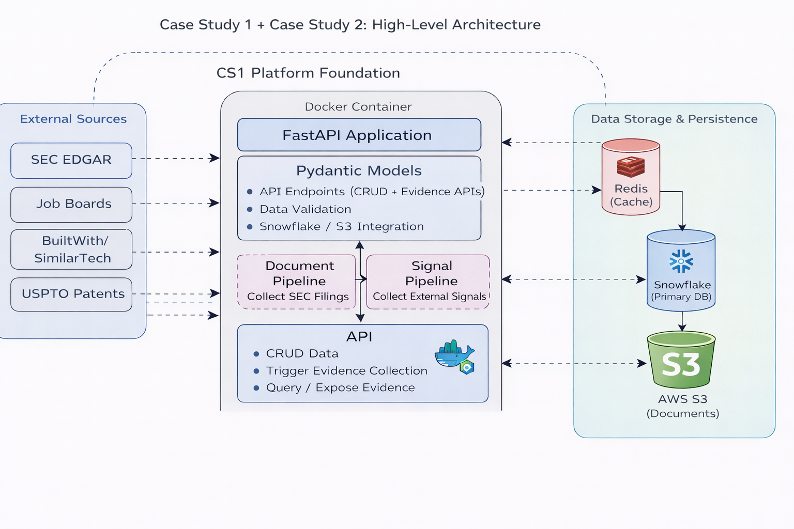

# PE Org-AI-R Platform - Case Study 2: Evidence Collection

AI Readiness Assessment Platform for Private Equity Portfolio Companies with automated SEC filings collection and external operational signals analysis.

## 🎯 Project Overview

This platform automates the collection and analysis of evidence for AI readiness assessment across multiple portfolio companies. It combines:

- **SEC Filings Analysis**: Automated download, parsing, and section-aware chunking of 10-K, 10-Q, and 8-K filings
- **External Signals Collection**: Real-time operational metrics from jobs, tech stack, patents, and leadership data
- **Composite Scoring**: Weighted AI readiness scores across 4 signal categories
- **Cloud Storage**: Snowflake for structured data, optional S3 for raw document archival

### System Architecture



### Target Companies (10)

| Ticker | Company Name              | Industry            |
| ------ | ------------------------- | ------------------- |
| ADP    | Automatic Data Processing | Business Services   |
| CAT    | Caterpillar Inc.          | Manufacturing       |
| DE     | Deere & Company           | Manufacturing       |
| GS     | Goldman Sachs             | Financial Services  |
| HCA    | HCA Healthcare            | Healthcare Services |
| JPM    | JPMorgan Chase            | Financial Services  |
| PAYX   | Paychex Inc.              | Business Services   |
| TGT    | Target Corporation        | Retail              |
| UNH    | UnitedHealth Group        | Healthcare Services |
| WMT    | Walmart Inc.              | Retail              |

---

## 📋 Prerequisites

- **Python 3.11+** (project uses Python 3.11+ features)
- **Poetry 1.5+** for dependency management
  - Install: `curl -sSL https://install.python-poetry.org | python3 -`
- **Docker** (for Redis)
- **Snowflake account** with database and warehouse
  - Free trial: https://signup.snowflake.com/
- **AWS S3** (optional - for raw filing storage)

### Optional API Keys (for External Signals)

- **SERPAPI_KEY**: [SerpApi](https://serpapi.com/) for job postings data
- **BUILTWITH_API_KEY**: [BuiltWith Free API](https://api.builtwith.com/free-api) for tech stack
- **LENS_API_KEY**: [Lens.org](https://docs.api.lens.org/) for patent data
- **LINKEDIN_API_KEY**: Third-party API for leadership signals (optional)

**Note:** Pipeline runs with graceful degradation if API keys are missing.

---

## 🚀 Quick Start

```bash
# 1. Clone the repository
git clone <REPO_URL>
cd case_study2

# 2. Install dependencies
poetry install

# 3. Configure environment (see Configuration section below)

# Edit .env with your credentials

# 4. Start Redis
docker run -d --name redis-local -p 6379:6379 redis:7-alpine

# 5. Run database migrations
poetry run alembic upgrade head

# 6. Start the API server
poetry run uvicorn app.main:app --reload

# 7. Access interactive docs
# Open: http://127.0.0.1:8000/docs
```

**Verify setup:**

```bash
# Health check
curl http://localhost:8000/health

# Expected: {"status": "healthy", "version": "1.0.0"}
```

---

## ⚙️ Configuration

### 1. Snowflake Setup

#### Create Database and Warehouse

```sql
-- Connect to Snowflake Web UI: https://app.snowflake.com/

-- 1. Create warehouse
CREATE WAREHOUSE IF NOT EXISTS COMPUTE_WH WITH WAREHOUSE_SIZE = 'XSMALL';
USE WAREHOUSE COMPUTE_WH;

-- 2. Create database and schema
CREATE DATABASE IF NOT EXISTS PE_ORG_AIR;
USE DATABASE PE_ORG_AIR;
USE SCHEMA PUBLIC;

-- 3. Verify setup
SHOW DATABASES;
SHOW WAREHOUSES;
```

#### Insert Seed Data (Industries)

```sql
-- Required for company foreign key relationships
INSERT INTO industries (id, name, sector, h_r_base) VALUES
    ('550e8400-e29b-41d4-a716-446655440001', 'Manufacturing', 'Industrials', 72),
    ('550e8400-e29b-41d4-a716-446655440002', 'Healthcare Services', 'Healthcare', 78),
    ('550e8400-e29b-41d4-a716-446655440003', 'Business Services', 'Services', 75),
    ('550e8400-e29b-41d4-a716-446655440005', 'Financial Services', 'Financial', 80),
    ('550e8400-e29b-41d4-a716-446655440004', 'Retail', 'Consumer', 70);

-- Verify
SELECT * FROM industries;
```

#### Run Alembic Migrations

```bash
# Apply all migrations (creates tables: documents, document_chunks, external_signals, etc.)
poetry run alembic upgrade head

# Check current migration
poetry run alembic current

# Expected output: 003_add_company_signal_summaries (head)
```

### 2. Environment Variables

Create `.env` file in project root:

```bash
# ==============================================
# Application
# ==============================================
APP_NAME="PE Org-AI-R Platform"
APP_VERSION="1.0.0"
DEBUG=true

# ==============================================
# Snowflake (REQUIRED)
# ==============================================
SNOWFLAKE_ACCOUNT=xy12345.us-east-1  # Your account identifier
SNOWFLAKE_USER=your_username
SNOWFLAKE_PASSWORD=your_password
SNOWFLAKE_DATABASE=PE_ORG_AIR
SNOWFLAKE_SCHEMA=PUBLIC
SNOWFLAKE_WAREHOUSE=COMPUTE_WH

# ==============================================
# Redis (REQUIRED for API caching)
# ==============================================
REDIS_HOST=localhost
REDIS_PORT=6379
REDIS_DB=0

# ==============================================
# AWS S3 (OPTIONAL - for raw filing storage)
# ==============================================
AWS_ACCESS_KEY_ID=your_access_key_id
AWS_SECRET_ACCESS_KEY=your_secret_access_key
AWS_REGION=us-east-1
S3_BUCKET=your-bucket-name

# ==============================================
# External API Keys (OPTIONAL - graceful degradation)
# ==============================================
# SerpAPI for job postings (technology_hiring signals)
SERPAPI_KEY=your_serpapi_key

# BuiltWith for tech stack (digital_presence signals)
BUILTWITH_API_KEY=your_builtwith_key

# Lens.org for patents (innovation_activity signals)
LENS_API_KEY=your_lens_token

# LinkedIn API for leadership (leadership_signals - optional)
LINKEDIN_API_KEY=your_linkedin_key
```

### 3. Redis Setup

```bash
# Option 1: Docker (Recommended)
docker run -d --name redis-local -p 6379:6379 redis:7-alpine

# Verify
docker ps | grep redis

# Option 2: Docker Compose
cd docker
docker-compose --env-file ../.env up -d
```

---

## 📊 Evidence Collection

### Using FastAPI Endpoints (Recommended)

**1. Start the API server:**

```bash
poetry run uvicorn app.main:app --reload
```

**2. Trigger evidence collection via API:**

```bash
# Collect SEC documents + external signals for specific companies
curl -X POST "http://localhost:8000/api/v1/evidence/backfill" \
  -H "Content-Type: application/json" \
  -d '{
    "tickers": ["JPM", "WMT", "GS"],
    "include_documents": true,
    "include_signals": true,
    "years_back": 3
  }'

# Response:
# {
#   "task_id": "f47ac10b-58cc-4372-a567-0e02b2c3d479",
#   "status": "queued",
#   "companies_queued": 3,
#   "message": "Backfill started for 3 companies: JPM, WMT, GS"
# }
```

**3. Monitor progress:**

```bash
# Check overall statistics
curl "http://localhost:8000/api/v1/evidence/stats"

# View target companies
curl "http://localhost:8000/api/v1/target-companies"

# Get documents for a company
curl "http://localhost:8000/api/v1/documents?ticker=JPM"
```

### Using Command Line Script

```bash
# Collect for specific companies (documents + signals)
poetry run python scripts/collect_evidence.py --companies JPM,WMT,GS

# Documents only (faster)
poetry run python scripts/collect_evidence.py --companies CAT,DE,UNH --documents-only

# Signals only (no SEC downloads)
poetry run python scripts/collect_evidence.py --companies all --signals-only

# Custom parameters
poetry run python scripts/collect_evidence.py \
  --companies ADP,PAYX \
  --years-back 2 \
  --email your.email@university.edu
```

**Script Options:**

- `--companies <TICKERS>` – Comma-separated tickers or "all" (default: all 10 companies)
- `--documents-only` – Only collect SEC filings (skip external signals)
- `--signals-only` – Only collect external signals (skip SEC)
- `--years-back <N>` – Years of historical filings (default: 3, range: 1-10)
- `--email <EMAIL>` – SEC EDGAR email (default: student@university.edu)

---

## 📚 API Documentation

### Interactive Documentation

- **Swagger UI**: http://127.0.0.1:8000/docs
- **ReDoc**: http://127.0.0.1:8000/redoc
- **OpenAPI JSON**: http://127.0.0.1:8000/openapi.json

### Key Endpoints

#### Evidence Collection

```bash
# Trigger evidence collection (background task)
POST /api/v1/evidence/backfill
Body: {
  "tickers": ["JPM", "WMT"],      # Optional: omit for all companies
  "include_documents": true,       # Collect SEC filings
  "include_signals": true,         # Collect external signals
  "years_back": 3                  # Historical data range
}

# Get evidence statistics
GET /api/v1/evidence/stats

# Get company evidence (documents + signals)
GET /api/v1/companies/{company_id}/evidence

# Get target companies list
GET /api/v1/target-companies
```

#### Documents

```bash
# List documents
GET /api/v1/documents?ticker=JPM&limit=10

# Get document chunks
GET /api/v1/documents/{document_id}/chunks
```

#### Signals

```bash
# List signals for a company
GET /api/v1/signals?company_id={company_id}

# Get signal summary with composite score
GET /api/v1/companies/{company_id}/signals
```

#### Health Check

```bash
GET /health
# Response: {"status": "healthy", "version": "1.0.0"}
```

---

## 🗄️ Database Schema

### Core Tables (Alembic Migrations)

**Migration 001: Core Tables**

- `industries` – Industry baselines and sectors
- `companies` – Portfolio company information
- `assessments` – AI readiness assessment records
- `dimension_scores` – Detailed dimension-level scores

**Migration 002: Case Study 2 Extensions**

- `documents` – SEC filings metadata (10-K, 10-Q, 8-K)
- `document_chunks` – Section-aware text segments (~1000 words)
- `external_signals` – Operational readiness indicators

**Migration 003: Signal Summaries**

- `company_signal_summaries` – Aggregated AI readiness scores

### Key Tables Details

**documents:**

- Stores SEC filing metadata and status
- Fields: `id`, `company_id`, `ticker`, `filing_type`, `filing_date`, `content_hash`, `word_count`, `chunk_count`, `status`, `s3_key`
- Deduplication via `content_hash`

**document_chunks:**

- Section-aware text segments for LLM processing
- Fields: `id`, `document_id`, `chunk_index`, `content`, `section`, `start_char`, `end_char`, `word_count`
- Section examples: `item_1`, `item_1a`, `item_7`, `item_7a`

**external_signals:**

- Operational readiness metrics
- Fields: `id`, `company_id`, `category`, `source`, `signal_date`, `normalized_score` (0-100), `confidence` (0-1), `metadata` (JSON)
- Categories: `technology_hiring`, `digital_presence`, `innovation_activity`, `leadership_signals`

**company_signal_summaries:**

- Aggregated scores per company
- Fields: `company_id`, `ticker`, `technology_hiring_score`, `digital_presence_score`, `innovation_activity_score`, `leadership_signals_score`, `composite_score`, `signal_count`, `last_updated`
- Composite score weights: hiring 30%, digital 25%, innovation 25%, leadership 20%

---

## 🧪 Testing

```bash
# Run all tests
poetry run pytest

# Run with coverage
poetry run pytest --cov=app --cov-report=term-missing

# Run specific test file
poetry run pytest tests/test_document_chunker.py -v

# Run tests matching pattern
poetry run pytest -k "test_chunk" -v
```

---

## 🔍 Data Validation

### Snowflake Queries

**Check document collection status:**

```sql
SELECT
    ticker,
    filing_type,
    COUNT(*) as document_count,
    SUM(chunk_count) as total_chunks,
    MAX(filing_date) as latest_filing
FROM documents
WHERE ticker IN ('ADP', 'CAT', 'DE', 'GS', 'HCA', 'JPM', 'PAYX', 'TGT', 'UNH', 'WMT')
GROUP BY ticker, filing_type
ORDER BY ticker, filing_type;
```

**Check signal collection:**

```sql
SELECT
    c.ticker,
    COUNT(DISTINCT es.id) as signal_count,
    css.composite_score
FROM companies c
LEFT JOIN external_signals es ON c.id = es.company_id
LEFT JOIN company_signal_summaries css ON c.id = css.company_id
WHERE c.ticker IN ('ADP', 'CAT', 'DE', 'GS', 'HCA', 'JPM', 'PAYX', 'TGT', 'UNH', 'WMT')
GROUP BY c.ticker, css.composite_score
ORDER BY css.composite_score DESC;
```

**Verify section-aware chunking:**

```sql
SELECT
    d.ticker,
    d.filing_type,
    c.section,
    COUNT(*) as chunk_count
FROM document_chunks c
JOIN documents d ON c.document_id = d.id
WHERE d.ticker = 'JPM'
GROUP BY d.ticker, d.filing_type, c.section
ORDER BY d.filing_type, c.section;
```

---

## 🛠️ Development

### Project Structure

```
case_study2/
├── app/
│   ├── config.py                   # Settings (Snowflake, Redis, APIs)
│   ├── main.py                     # FastAPI application
│   ├── database/
│   │   ├── orm/                    # SQLAlchemy models
│   │   │   ├── document.py
│   │   │   ├── document_chunk.py
│   │   │   ├── external_signal.py
│   │   │   └── company_signal_summary.py
│   │   └── connection.py           # Snowflake connection
│   ├── models/
│   │   ├── document.py             # Pydantic models
│   │   ├── signal.py
│   │   └── evidence.py             # TARGET_COMPANIES
│   ├── pipelines/
│   │   ├── sec_edgar.py            # SEC downloader
│   │   ├── document_parser.py      # iXBRL cleaning + section extraction
│   │   ├── document_chunker.py     # Semantic chunking
│   │   ├── job_signals.py          # SerpAPI + careers page
│   │   ├── tech_signals.py         # BuiltWith API
│   │   ├── patent_signals.py       # Lens.org API
│   │   └── leadership_signals.py   # Website scraping
│   ├── routers/
│   │   ├── evidence.py             # /api/v1/evidence/*
│   │   ├── documents.py            # /api/v1/documents/*
│   │   └── signals.py              # /api/v1/signals/*
│   └── services/
│       ├── snowflake.py            # Database operations
│       └── s3_storage.py           # S3 uploads
├── scripts/
│   ├── collect_evidence.py         # CLI evidence collection
│   ├── backfill_companies.py       # Seed company data
│   └── generate_report.py          # Generate assessment reports
├── alembic/
│   ├── env.py                      # Alembic environment
│   └── versions/                   # Migration files
│       ├── 001_initial_core_tables.py
│       ├── 002_case_study_2_extensions.py
│       └── 003_add_company_signal_summaries.py
├── tests/
│   ├── test_document_parser.py
│   ├── test_document_chunker.py
│   └── ...
├── data/                           # Gitignored runtime data
│   ├── raw/sec/                    # Transient SEC downloads
│   └── evidence_summary.json       # Collection statistics
├── pyproject.toml                  # Poetry dependencies
├── alembic.ini                     # Alembic configuration
└── README.md
```

---

## 👥 Team Member Contributions

| Team Member      | Contribution             | Key Components                                                                |
| ---------------- | ------------------------ | ----------------------------------------------------------------------------- |
| **WEI CHENG TU** | SEC EDGAR Pipeline       | SEC downloader, document parser, section extraction, semantic chunking        |
| **Nisarg Sheth** | External Signal Pipeline | Job signals, tech stack, patent signals, leadership signals, scoring logic    |
| **YU TZU LI**    | API Endpoints            | FastAPI routers, background tasks, evidence collection API, database services |

### Individual Responsibilities

**WEI CHENG TU:**

- Implemented `SECEdgarPipeline` for automated filing downloads
- Built `DocumentParser` with iXBRL/XBRL noise removal
- Designed section-aware extraction for 10-K, 10-Q, 8-K forms
- Developed `SemanticChunker` with 1000-word overlapping segments
- Created Alembic migrations for `documents` and `document_chunks` tables

**Nisarg Sheth:**

- Built `JobSignalCollector` with SerpAPI and careers page integration
- Implemented `TechStackCollector` using BuiltWith API
- Developed `PatentSignalCollector` with Lens.org API
- Created `LeadershipSignalCollector` with website scraping
- Designed normalized scoring (0-100) and confidence metrics (0-1)
- Implemented composite score calculation with category weights

**YU TZU LI:**

- Design high-level system architecture
- Created Snowflake service layer for database operations
- Developed S3 storage service for raw filing archival
- Integrated all pipeline components into unified API
